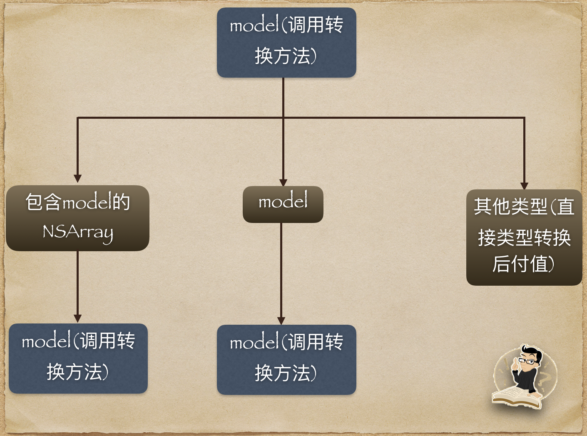

# MappingModel


#### Example

将NSDictionary转model：

```
PersonModel * model = [PersonModel MXmodelWithDictionary:dict];
```
将model转NSDictionary：

```
NSDictionary * dict ＝ [model modelToDict];
```

转化NSDictionary转的数组类型：

```
+ (NSDictionary *)contentClass {
    return @{@"theArray":[ChildModel class],@"theArr":[SubModel class]};
}
```


特殊字段的映射：

```
+ (NSDictionary *)changeDictKey {
    return @{@"id":@"nameId"};
}
```

model自动映射的大体流程为



## 如何进行赋值？ 

* 先要获取当前model的所有属性

`uint propertyCount;
objc_property_t *ps = class_copyPropertyList([objeClass class], &propertyCount);`

找到任意一个属性获取它的详细信息我们看一下
`
 objc_property_t property = ps[i];
 const char *propertyName = property_getName(property);
 const char *propertyAttributes = property_getAttributes(property);
  NSString *type = [NSString stringWithUTF8String:propertyAttributes];
`

打印出 **type** 为`T@"NSString",C,N,V_name`。

* 其中`T`，属性总是以T开头.
* `@"NSString"`代表属性的类型，如果是数组则为`@"NSArray"`，`@`表示为是一个对象，不是基本数据类型
* `C`表示属性为copy类型
* `N`表示nonatomic
* `V_name`为属性变量property的名字

@property (readonly, copy, nonatomic) NSString * name;
它的详细内容为`T@"NSString",R,C,N,V_name`
如果将该属性设置为`@dynamic`,则详细内容则变为`T@"NSString",C,D,N`

协议属性@property (nonatomic, strong) NSArray <SubModel>* their
，的表示为`T@"NSArray<SubModel>",&,N,V_theArr`
如果想了解全部定义规则[查看全部](https://developer.apple.com/library/content/documentation/Cocoa/Conceptual/ObjCRuntimeGuide/Articles/ocrtPropertyIntrospection.html) 。

根据属性的描述信息，我们可以得到属性的类型(T后面的第一个字符)，比如`@`代表的是对象类型, 可参照[查看全部](https://developer.apple.com/library/content/documentation/Cocoa/Conceptual/ObjCRuntimeGuide/Articles/ocrtTypeEncodings.html)
如下是对应关系

* `v`->`Void`
* `B`->`Bool`
* `c`->`Int8`
* `C`->`UInt8`
* `s`->`Int16`
* `S`->`UInt16`
* `i`->`Int32`
* `I`->`UInt32`
* `l`->`Int32`
* `L`->`UInt32`
* `q`->`Int64`
* `Q`->`UInt64`
* `f`->`Float`
* `d`->`Double`
* `D`->`Long`
* `#`->`Class`
* `:`->`SEL`
* `*`->`CFString`
* `^`->`Pointer`
* `[`->`CFArray`
* `(`->`Union`
* `{`->`Struct`
* `@`->`对象类型（Object）`

其中`对象类型（Object`中又包含了很多类型`NSString`、`NSMutableString`、`NSDictionary`、`NSMutableDictionary`、`NSArray`、`NSMutableArray`、`NSSet`、`NSMutableSet`、`NSData`、`NSMutableData`、`NSDate`、`NSNumber`、`NSDecimalNumber`、`NSURL`、`NSValue`、`NSProtocol`

根据这些我们可以分别根据属性的类型去做相应的处理，除了这些类型，还有我们自定义的类型，比如`@property (nonatomic, strong) ChildModel * child;`
这种类型也需要我们单独处理。

属性的`set`、`get`方法我也也能得到（根据属性名字）
对属性赋值的时候我们可以通过（提供2种方法）赋值

```
 NSNumber *number = (NSNumber *)value;
            void (*func)(id, SEL, NSNumber *) = (void *)imp;
            func(currentClass, sel, number);
```

```
 NSNumber *number = (NSNumber *)value;
[currentClass performSelectorOnMainThread: sel                                    withObject:number waitUntilDone:[NSThread isMainThread]];
```

 这样属性的类型，我们就确定了，dynamic标示的类型我们不需要解析，Array类型我们遍历去解析，Dictionary类型我们直接根据属性赋值


#### Author


“caoye”, “1595576349@qq.com”

